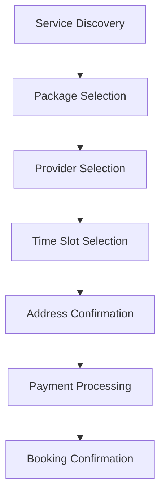

# Functional Documentation

## Overview

Ghulmil Application is a comprehensive service booking platform that connects customers with professional service providers. The application provides an end-to-end solution for discovering, booking, tracking, and reviewing home services with real-time updates and seamless user experience.

## Core Features

### 1. Service Discovery
**Purpose**: Allow users to browse and discover available services

**Functionality**:
- Display service categories with visual icons
- Show service ratings and reviews
- Filter by availability, price, and location
- Quick service comparison
- Featured services highlighting

**User Flow**:
1. User opens the app and lands on home screen
2. Browse available service categories
3. View service details and pricing
4. Select desired service for booking

### 2. Service Booking System
**Purpose**: Enable users to book services with preferred providers

**Components**:
- **Service Selection** - Choose from available service categories
- **Package Selection** - Select service packages with different pricing tiers
- **Provider Selection** - Choose from available service providers
- **Time Slot Booking** - Select convenient time slots
- **Address Confirmation** - Set service delivery location

**Booking Flow**:


### 3. Real-time Tracking
**Purpose**: Provide live updates on service provider location and ETA

**Features**:
- GPS-based location tracking
- Real-time ETA updates
- Provider contact information
- Service progress indicators
- Route visualization (planned)

**Tracking States**:
- **Pending**: Booking confirmed, waiting for provider
- **En Route**: Provider heading to location
- **Arrived**: Provider at location
- **In Progress**: Service being performed
- **Completed**: Service finished

### 4. Payment System
**Purpose**: Secure and flexible payment processing

**Features**:
- Multiple payment methods (Credit Card, Digital Wallets, Cash)
- Detailed price breakdown
- Service cost calculation
- Tax and fee transparency
- Payment confirmation and receipts

**Payment Flow**:
1. Review booking details and pricing
2. Select payment method
3. Enter payment information
4. Confirm payment
5. Receive confirmation and receipt

### 5. Review and Rating System
**Purpose**: Quality assurance and service improvement

**Features**:
- Star-based rating system (1-5 stars)
- Detailed review comments
- Photo upload capability
- Provider response system
- Review moderation

**Review Process**:
- Automatic review request after service completion
- Review period window (7 days)
- Provider rating impact on visibility
- Quality score calculation

### 6. Subscription Management
**Purpose**: Recurring service automation

**Features**:
- Recurring booking schedules
- Subscription plan management
- Pause/resume functionality
- Custom frequency settings
- Subscription modification

**Subscription Types**:
- Weekly recurring services
- Monthly maintenance plans
- Seasonal service packages
- Custom frequency options

### 7. Emergency Services
**Purpose**: Quick booking for urgent service needs

**Features**:
- Priority booking system
- Emergency contact integration
- Express service options
- Immediate availability matching
- Emergency response coordination

## User Roles and Permissions

### 1. Customer Role
**Capabilities**:
- Browse and book services
- Track service providers
- Make payments
- Leave reviews and ratings
- Manage subscriptions
- Access booking history

**Restrictions**:
- Cannot access provider features
- Limited to customer-facing interfaces

### 2. Service Provider Role
**Capabilities**:
- Accept/reject booking requests
- Update availability status
- Track earnings and performance
- Manage service schedules
- Respond to customer reviews

**Restrictions**:
- Cannot book services for themselves
- Limited to provider-specific features

### 3. Admin Role
**Capabilities**:
- Manage service categories
- Monitor platform performance
- Handle disputes and issues
- Generate reports and analytics
- Manage user accounts

## Business Logic

### Service Availability Algorithm
```dart
class AvailabilityCalculator {
  bool isSlotAvailable({
    required DateTime slotTime,
    required List<Booking> existingBookings,
    required int providerCapacity
  }) {
    int concurrentBookings = existingBookings
        .where((booking) =>
            booking.scheduledAt.isAtSameMomentAs(slotTime) ||
            booking.scheduledAt.isBefore(slotTime.add(serviceDuration)) &&
            booking.scheduledAt.isAfter(slotTime.subtract(serviceDuration)))
        .length;

    return concurrentBookings < providerCapacity;
  }
}
```

### Pricing Calculation
```dart
class PriceCalculator {
  double calculateTotal({
    required double basePrice,
    required double duration,
    required bool isEmergency,
    required double distance
  }) {
    double subtotal = basePrice;
    double distanceFee = distance * DISTANCE_RATE;
    double emergencyFee = isEmergency ? EMERGENCY_PREMIUM : 0;

    return subtotal + distanceFee + emergencyFee;
  }
}
```

### Provider Matching Algorithm
```dart
class ProviderMatcher {
  List<Provider> findBestProviders({
    required String serviceId,
    required DateTime preferredTime,
    required Location customerLocation,
    required int maxResults = 5
  }) {
    List<Provider> availableProviders = getAvailableProviders(serviceId, preferredTime);

    return availableProviders
        .map((provider) => {
          'provider': provider,
          'score': calculateMatchScore(provider, customerLocation)
        })
        .sorted((a, b) => b['score'].compareTo(a['score']))
        .take(maxResults)
        .map((item) => item['provider'])
        .toList();
  }
}
```

## Data Models and Relationships

### Core Entities

#### Service
```dart
@freezed
class Service with _$Service {
  const factory Service({
    required String id,
    required String title,
    String? subtitle,
    required List<Package> packages,
    required double rating,
    required List<String> tags,
    String? imageUrl,
  }) = _Service;
}
```

#### Booking
```dart
@freezed
class Booking with _$Booking {
  const factory Booking({
    required String id,
    required String serviceId,
    required String packageId,
    required String providerId,
    required BookingStatus status,
    required DateTime createdAt,
    DateTime? scheduledAt,
    PriceBreakdown? price,
    Provider? provider,
  }) = _Booking;
}
```

#### BookingStatus
```dart
enum BookingStatus {
  pending,      // Awaiting provider confirmation
  confirmed,    // Confirmed by provider
  enroute,      // Provider heading to location
  inProgress,   // Service being performed
  completed,    // Service finished successfully
  cancelled     // Booking cancelled
}
```

### Entity Relationships
```
Customer (1) ─── (N) Booking (N) ─── (1) Service
Booking (1) ─── (1) Provider
Booking (1) ─── (1) Package
Service (1) ─── (N) Package
Provider (1) ─── (N) Review
Customer (1) ─── (N) Review
```

## User Journey Scenarios

### Scenario 1: First-time Service Booking
1. **Discovery Phase**
   - User downloads and opens Ghulmil app
   - Views featured services on home screen
   - Browses available service categories
   - Reads service descriptions and reviews

2. **Selection Phase**
   - Selects desired service category
   - Chooses appropriate service package
   - Reviews pricing and inclusions
   - Checks provider availability

3. **Booking Phase**
   - Selects convenient time slot
   - Confirms service address
   - Reviews and confirms booking details
   - Completes payment process

4. **Service Phase**
   - Receives booking confirmation
   - Gets notified when provider is assigned
   - Tracks provider location in real-time
   - Service provider arrives and performs work

5. **Completion Phase**
   - Service is completed
   - User receives completion notification
   - User rates and reviews the service
   - Receipt and invoice generated

### Scenario 2: Emergency Service Request
1. **Urgent Need**
   - User experiences emergency situation
   - Accesses emergency booking flow
   - Selects urgent service type

2. **Priority Processing**
   - System identifies nearby available providers
   - Priority notification sent to providers
   - Express booking confirmation

3. **Rapid Response**
   - Provider accepts emergency request
   - Immediate navigation assistance
   - Real-time location tracking enabled

### Scenario 3: Subscription Setup
1. **Recurring Need**
   - User identifies regular service requirement
   - Browses subscription options
   - Selects appropriate subscription plan

2. **Configuration**
   - Sets service frequency (weekly/monthly)
   - Configures preferred time slots
   - Sets service address and preferences

3. **Automation**
   - System automatically creates bookings
   - User receives booking reminders
   - Seamless recurring service delivery

## Quality Assurance Features

### Service Standards
- **Provider Verification** - Background checks and certification validation
- **Service Guarantees** - Quality assurance commitments
- **Insurance Coverage** - Service liability protection
- **Performance Metrics** - Provider rating and performance tracking

### Customer Protection
- **Secure Payments** - PCI-compliant payment processing
- **Service Warranty** - Post-service issue resolution
- **Dispute Resolution** - Customer support and mediation
- **Privacy Protection** - Data security and privacy compliance

## Analytics and Reporting

### Key Metrics
- **Booking Conversion Rate** - Service discovery to booking completion
- **Customer Retention** - Repeat booking frequency
- **Provider Performance** - Service quality and reliability
- **Platform Revenue** - Service fees and commission tracking
- **User Satisfaction** - Rating and review analysis

### Performance Indicators
- **Average Booking Time** - From discovery to confirmation
- **Service Completion Rate** - Successful vs. cancelled bookings
- **Response Time** - Provider response to booking requests
- **Customer Support** - Issue resolution time and satisfaction

## Future Enhancements

### Planned Features
1. **AI-Powered Recommendations** - Smart service suggestions based on user behavior
2. **Advanced Scheduling** - Calendar integration and smart scheduling
3. **Loyalty Program** - Rewards and benefits for frequent users
4. **Multi-Service Bookings** - Combined service packages
5. **Smart Contracts** - Automated service agreements

### Technology Improvements
1. **Offline Mode** - Enhanced offline capabilities
2. **Push Notifications** - Advanced notification system
3. **Chat System** - In-app communication between customers and providers
4. **AR Integration** - Augmented reality for service visualization
5. **IoT Integration** - Smart home device integration

## Integration Points

### External Systems
- **Payment Gateways** - Stripe, PayPal, local payment providers
- **Mapping Services** - Google Maps, Mapbox for location services
- **SMS/Email Services** - Twilio, SendGrid for notifications
- **Calendar Integration** - Google Calendar, Outlook sync
- **Analytics Platforms** - Firebase Analytics, Mixpanel

### Internal Systems
- **User Management** - Authentication and authorization
- **Content Management** - Service and provider management
- **Financial System** - Billing and commission calculation
- **Reporting Dashboard** - Analytics and business intelligence
- **Customer Support** - Ticketing and issue tracking
